# Prosody Interface — Complete Pipeline Architecture Reference

This document provides a complete, presentation-ready architectural reference of every pipeline in the Prosody Interface. Each pipeline includes an end-to-end flowchart/diagram, input/output contracts, algorithm mechanics, and concise presentation talking points.

---

## Table of Contents
1. [End-to-End System & Runtime Data Flow](#1-end-to-end-system--runtime-data-flow)
2. [Speech Ingestion & VAD Chunking Pipeline (Silero VAD)](#2-speech-ingestion--vad-chunking-pipeline-silero-vad)
3. [ASR Transcription & Alignment Pipeline (faster-whisper)](#3-asr-transcription--alignment-pipeline-faster-whisper)
4. [Grammatical Sentence & Punctuation Grouping Pipeline](#4-grammatical-sentence--punctuation-grouping-pipeline)
5. [Word-Level Stress Detection: WhiStress Pipeline](#5-word-level-stress-detection-whistress-pipeline)
6. [Syllable-Level Lexical Stress: LexiRep 768-D Pipeline](#6-syllable-level-lexical-stress-lexirep-768-d-pipeline)
7. [Fundamental Frequency (F0) Extraction: SWIPE Pipeline](#7-fundamental-frequency-f0-extraction-swipe-pipeline)
8. [Pitch Stylization: Piecewise Linear MAE via Dynamic Programming](#8-pitch-stylization-piecewise-linear-mae-via-dynamic-programming)
9. [Intonation & Phrase Trend Classification Pipeline](#9-intonation--phrase-trend-classification-pipeline)
10. [Pause & Hesitation Detection Pipeline](#10-pause--hesitation-detection-pipeline)
11. [Multi-Modal Fusion & Database Storage Pipeline](#11-multi-modal-fusion--database-storage-pipeline)
12. [Canonical Annotation & Summary Metrics Pipeline](#12-canonical-annotation--summary-metrics-pipeline)

---

## 1. End-to-End System & Runtime Data Flow

### Diagram
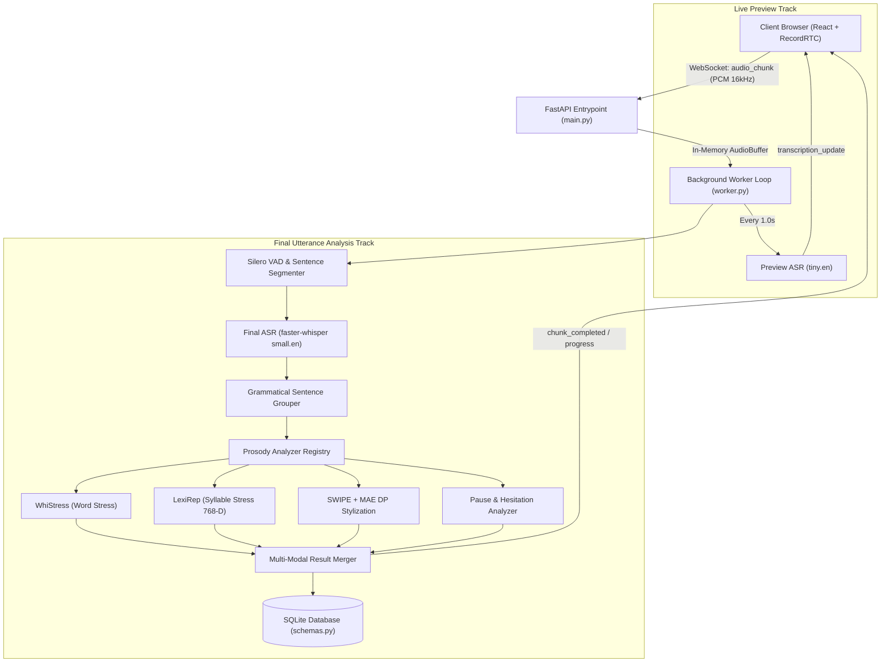

### Explanation
* **Purpose:** Provides dual-track operation: an instant live preview for interactive user feedback while speaking, paired with a high-fidelity prosody analysis track when utterances conclude.
* **Inputs:** 16kHz mono PCM chunks from `RecordRTC` streamed via `socket.io`.
* **Outputs:** Real-time waveform updates, grammatical transcripts, syllable/word stress tags, pitch contours, and exportable JSON reports.
* **Presentation Key Takeaway:** Decoupling preview ASR from the deep prosody worker guarantees zero UI lag while maintaining state-of-the-art acoustic modeling under the hood.

---

## 2. Speech Ingestion & VAD Chunking Pipeline (Silero VAD)

### Diagram
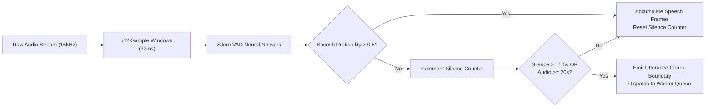

### Explanation
* **Purpose:** Separates continuous human speech into discrete, linguistically coherent utterances without cutting words in half.
* **Inputs:** Continuous 16kHz float32 audio stream.
* **Processing:** Evaluates speech probabilities in 32ms windows using Silero VAD (`torch.hub`). Employs a 1.5-second trailing silence threshold to declare an utterance boundary, with a 20-second safety clamp.
* **Outputs:** Exact `[start_sample, end_sample]` slices representing complete spoken phrases.
* **Presentation Key Takeaway:** Uses neural voice activity detection instead of raw energy thresholds, completely avoiding false cuts from background hums or mic clicks.

---

## 3. ASR Transcription & Alignment Pipeline (faster-whisper)

### Diagram
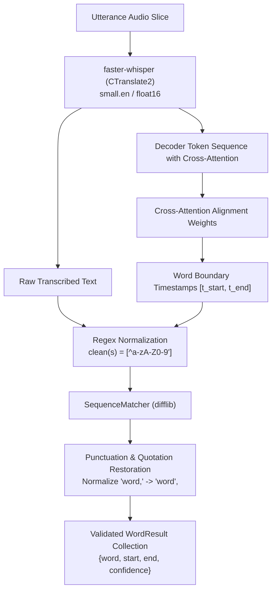

### Explanation
* **Purpose:** Converts audio into accurately spelled English text and generates sub-second temporal boundaries for every word.
* **Inputs:** 16kHz audio slice for the completed utterance.
* **Processing:** Runs CTranslate2-optimized Whisper. Extracts word timestamps directly from cross-attention heads. Employs a custom `difflib.SequenceMatcher` algorithm to prevent Whisper's word-alignment logic from dropping punctuation marks and quotes.
* **Outputs:** List of `WordResult` models with start/end seconds and transcription confidence scores.
* **Presentation Key Takeaway:** 4x faster than standard PyTorch Whisper via 8-bit/16-bit CTranslate2 quantization, with verified punctuation preservation.

---

## 4. Grammatical Sentence & Punctuation Grouping Pipeline

### Diagram
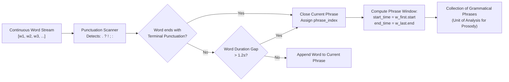

### Explanation
* **Purpose:** Groups flat word streams into natural grammatical sentences so prosodic analysis (intonation, stress) occurs within proper syntactic boundaries.
* **Inputs:** Flat array of `WordResult` objects from ASR.
* **Processing:** Scans words for sentence-ending punctuation (`.`, `?`, `!`, `;`). Employs a fallback acoustic pause detector (>1.2s gap) for unpunctuated run-on speech.
* **Outputs:** List of `PhraseResult` containers, each holding its constituent words, start time, and end time.
* **Presentation Key Takeaway:** Guarantees intonation trend classification (e.g. rising question vs. falling statement) is calculated per grammatical sentence, not per arbitrary buffer slice.

---

## 5. Word-Level Stress Detection: WhiStress Pipeline

### Diagram
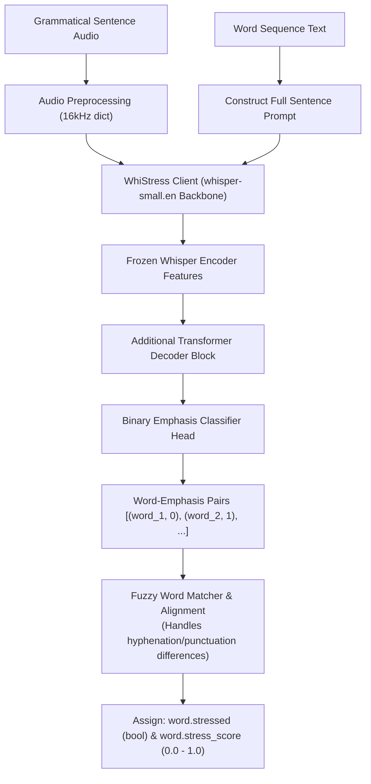

### Explanation
* **Purpose:** Identifies sentence-level emphatic stress (which words the speaker highlighted for rhetorical focus or contrast).
* **Inputs:** Sentence audio array and list of word tokens.
* **Processing:** Uses WhiStress. By passing the known transcription into the decoder, WhiStress avoids expensive autoregressive generation and runs a single forward classification pass. A fuzzy alignment reconciles Whisper tokens with WhiStress tokenization.
* **Outputs:** Boolean `stressed` flag and continuous `stress_score` per word.
* **Presentation Key Takeaway:** Distinguishes between rhetorical/pragmatic emphasis (WhiStress) and lexical/syllabic stress (LexiRep).

---

## 6. Syllable-Level Lexical Stress: LexiRep 768-D Pipeline

### Diagram
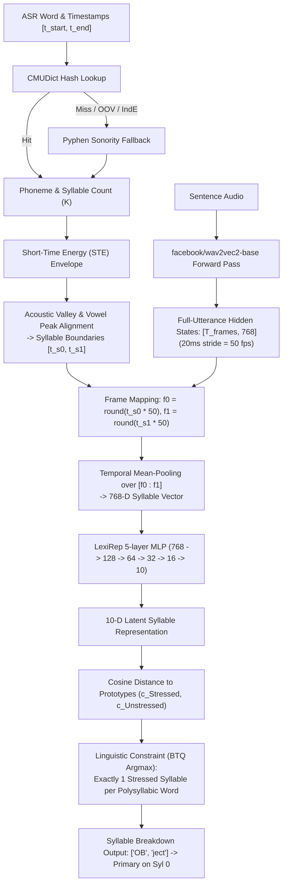

### Explanation
* **Purpose:** Detects within-word lexical stress placement (e.g. *OB-ject* noun vs *ob-JECT* verb) to pinpoint L2 pronunciation errors.
* **Inputs:** 16kHz sentence audio and word timestamp intervals.
* **Processing:**
  1. Syllabifies words using CMUDict with Pyphen sonority fallback (zero crashes on OOV/names).
  2. Aligns syllable boundaries to acoustic vowel energy peaks.
  3. Passes continuous audio through Wav2Vec 2.0 and mean-pools frame vectors over each syllable span, producing a 768-D contextual vector.
  4. Projects through the trained LexiRep 5-layer MLP into 10-D latent space.
  5. Enforces the one-stress-per-word linguistic constraint ($BTQ$).
* **Outputs:** Per-syllable boundary timestamps, stress classification (0 or 1), prototype margin, and 10-D manifold coordinates.
* **Presentation Key Takeaway:** Uses the **FUSED** multi-accent model to generalize across Indian English, TTS voices, and non-native learners without single-accent overfitting.

---

## 7. Fundamental Frequency (F0) Extraction: SWIPE Pipeline

### Diagram
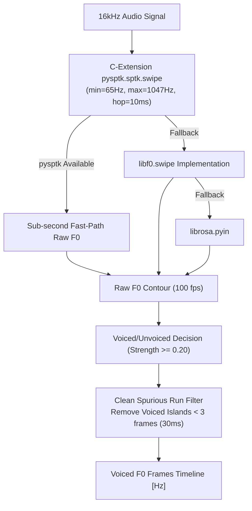

### Explanation
* **Purpose:** Extracts the physical vibration frequency of the vocal folds (pitch) across every 10ms frame of speech.
* **Inputs:** Raw 16kHz audio array.
* **Processing:** Uses SWIPE (Sawtooth Waveform Inspired Pitch Estimator). Compares the spectrum of the speech signal against the spectrum of a sawtooth wave with decaying harmonics. Filters out unvoiced speech using a 0.20 strength cutoff and strips spurious voiced islands shorter than 30ms.
* **Outputs:** Frame-level F0 values (in Hz) with 10ms temporal resolution.
* **Presentation Key Takeaway:** SWIPE is widely recognized in speech science as significantly more resistant to pitch-halving and octave-doubling errors than standard autocorrelation (YIN).

---

## 8. Pitch Stylization: Piecewise Linear MAE via Dynamic Programming

### Diagram
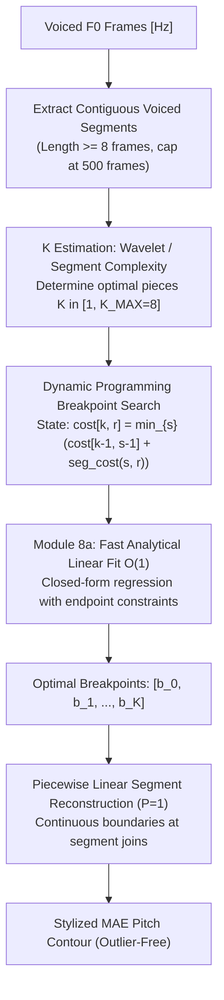

### Explanation
* **Purpose:** Replaces noisy, jittery raw pitch tracks with smooth, perceptually salient piecewise-linear pitch contours based on the Interspeech 2021 MAE criterion (Yarra & Ghosh).
* **Inputs:** Clean voiced F0 segments from SWIPE.
* **Processing:** Formulates stylization as an optimal segmentation problem. Finds $K$ linear pieces that minimize the Mean Absolute Error (L1 norm). The dynamic program tests potential breakpoints using an analytical closed-form fit, yielding a smooth curve that rejects octave spikes and recording glitches.
* **Outputs:** Stylized pitch curves, slope (semitones/sec), and continuous F0 tracks.
* **Presentation Key Takeaway:** Standard MSE (L2 norm) squares errors, pulling the pitch curve toward artificial octave jumps; MAE (L1 norm) ignores isolated outliers, preserving true musical and prosodic pitch.

---

## 9. Intonation & Phrase Trend Classification Pipeline

### Diagram
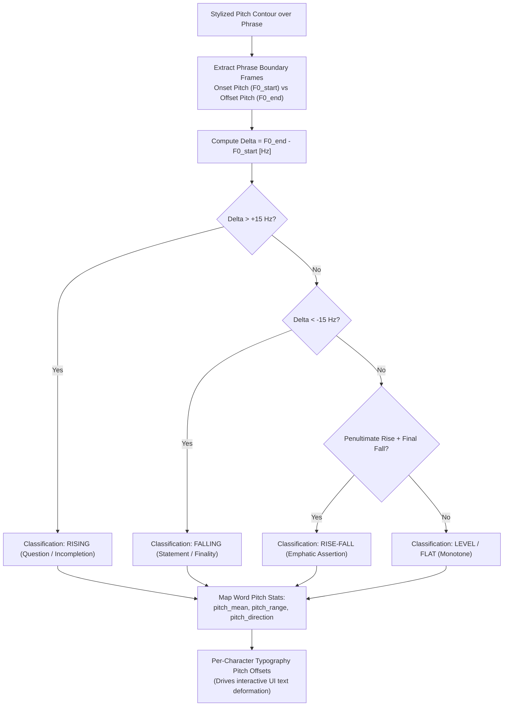

### Explanation
* **Purpose:** Determines communicative intent (question vs. statement vs. hesitation) and powers character-level typography effects.
* **Inputs:** Phrase word boundaries and stylized F0 contour.
* **Processing:** Analyzes delta pitch across the terminal words using a $\pm 15\text{ Hz}$ clinical threshold. Maps pitch stats (mean, range, trajectory) to each individual word, and normalizes values across the speaker's vocal range to compute vertical CSS text-stretching offsets.
* **Outputs:** Sentence-level intonation pattern and word-level pitch descriptors.
* **Presentation Key Takeaway:** Directly bridges acoustic science with visual UI design by translating pitch movements into dynamic typography.

---

## 10. Pause & Hesitation Detection Pipeline

### Diagram
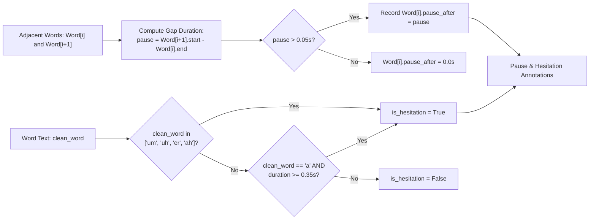

### Explanation
* **Purpose:** Detects fluency interruptions, unnatural silences, and filled pauses (disfluencies).
* **Inputs:** Word timestamp bounds and cleaned text tokens.
* **Processing:** Computes inter-word silent durations. Identifies lexical fillers (`um`, `uh`, `er`, `ah`) and includes an acoustic duration heuristic to catch prolonged "ahhh" sounds transcribed by Whisper as the article `"a"`.
* **Outputs:** `pause_after` duration in seconds and boolean `is_hesitation` flags.
* **Presentation Key Takeaway:** Enables objective fluency scoring by distinguishing between natural syntactic pausing (at commas/periods) and disfluent hesitation mid-phrase.

---

## 11. Multi-Modal Fusion & Database Storage Pipeline

### Diagram
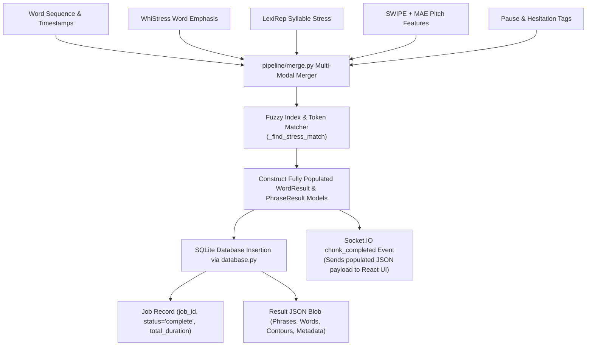

### Explanation
* **Purpose:** Merges independently executed analyzer outputs into a unified, coherent data schema without cross-module race conditions.
* **Inputs:** Separate result dictionaries from the stress, pitch, intonation, and pause analyzers.
* **Processing:** Resolves discrepancies in word tokenization across different models using fuzzy string and temporal matching (`_find_stress_match`). Assembles validated Pydantic models (`WordResult`, `PhraseResult`) and persists them to SQLite while broadcasting completion events over WebSockets.
* **Outputs:** Validated database record and live frontend JSON payload.
* **Presentation Key Takeaway:** Fault-tolerant architecture: if any single analyzer encounters an edge-case failure, the merger gracefully logs the error and preserves all other prosody dimensions.

---

## 12. Canonical Annotation & Summary Metrics Pipeline

### Diagram
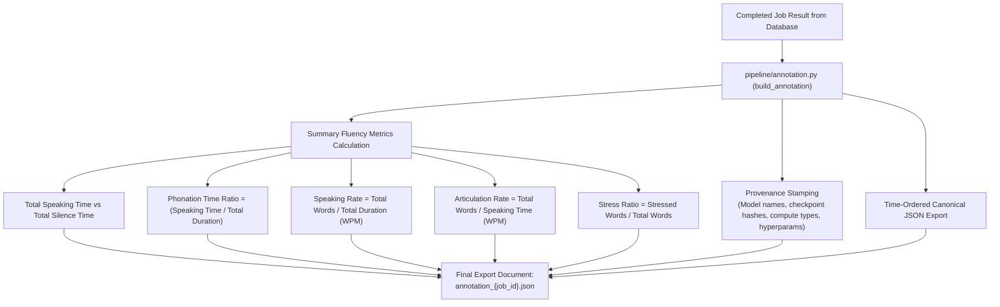

### Explanation
* **Purpose:** Transforms raw per-word timeline data into publication-grade speech metrics and reproducible research archives.
* **Inputs:** Stored job result JSON.
* **Processing:**
  - Calculates standard clinical speech metrics: **Speaking Rate** (overall words/min), **Articulation Rate** (words/min excluding pauses), and **Phonation Time Ratio** (percentage of time spent vocalizing).
  - Embeds complete model provenance (Whisper size, compute type, VAD thresholds, LexiRep checkpoint, SWIPE polynomial order) so results are 100% reproducible.
* **Outputs:** Canonical `annotation_{job_id}.json` document available for client download.
* **Presentation Key Takeaway:** Meets academic and clinical standards for speech evaluation by coupling raw word prosody with macro-level fluency indices.
